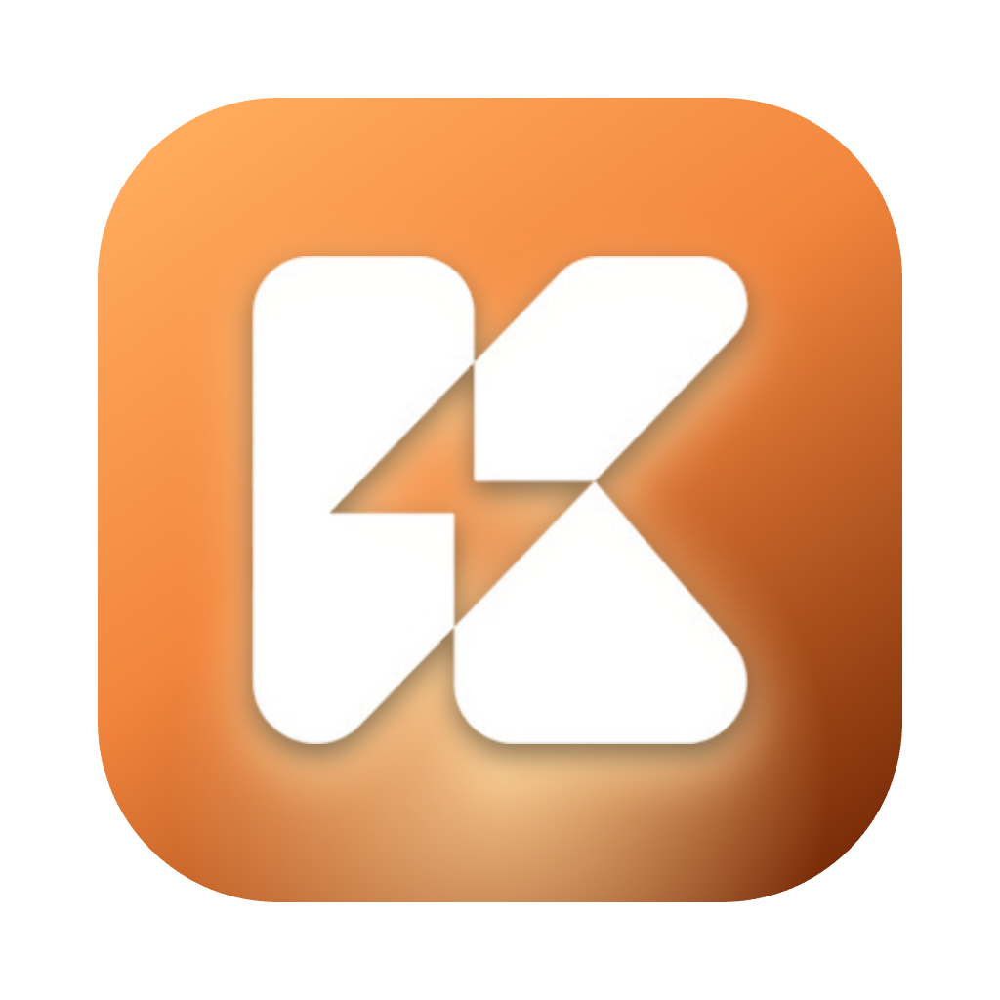
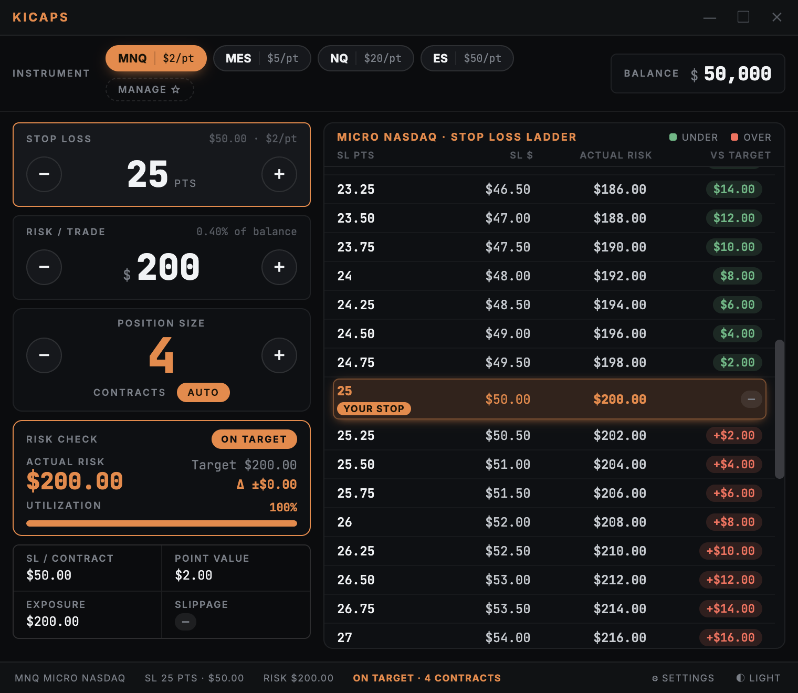

<div align="center">



# KiCaps

### Know your size before you take the trade.

A fast, offline futures **position-size calculator** for Windows & macOS. Set your stop and your risk — KiCaps tells you exactly how many contracts to trade, and turns **green / orange / red** the moment you step outside your limit.

<br/>

[](https://github.com/Ledian63S/KiCaps/releases/latest)


<br/>



</div>

---

## How it works

Position sizing is one equation, and KiCaps keeps it honest:

```
contracts = risk budget ÷ (stop loss in points × point value)
```

You give it three things — **instrument**, **stop loss**, and **risk per trade** — and it does the rest:

| It answers | Where you see it |
|---|---|
| *How many contracts?* | The big **Position Size** number |
| *Am I actually inside my risk limit?* | The **Risk Check** verdict — green (under) / orange (on target) / red (over) |
| *What if my stop were a bit wider or tighter?* | The **Stop Loss Ladder** — every nearby stop, priced out |

Because contracts are whole numbers, your real risk almost never lands exactly on your target. KiCaps shows that gap (**Δ**) and the **utilization** bar, so "close enough" is a decision you make, not one you discover later.

---

## Features

- **Verdict-first Risk Check** — actual risk, target, delta, and a utilization bar. The panel recolours so a glance is enough.
- **Stop Loss Ladder** — a scrollable table centred on your stop, showing SL $, actual risk, and how each nearby level lands vs target as colour-coded chips. Click any row to jump your stop there.
- **Fast input** — ± buttons, **↑/↓ arrow keys** (Shift = ×5), or the **mouse wheel** over a field. Or click and type. Inputs are filtered to digits only.
- **Manual override** — nudge contracts off the auto value, one click back to **AUTO**.
- **Resizable layout** — drag the divider between the sizing panel and the ladder; the width is remembered.
- **Instrument watchlist** — star your favourites for one-tap switching; hover a chip for the full name.
- **Risk modes** — a fixed dollar amount, or a % of account balance.
- **Dark / Light / System** themes, with reduced-motion support.
- **Remembers your setup** — balance, risk, and instrument persist between sessions (each toggleable).
- **Fully offline** — no network calls, no telemetry, fonts bundled locally.

---

## Keyboard & mouse

| Action | Shortcut |
|---|---|
| Adjust Stop Loss / Risk | `↑` `↓` (Shift = ×5) |
| Adjust Stop Loss / Risk | Mouse wheel over the field |
| Jump your stop to a ladder row | Click the row |
| Reset contracts to auto | Click **AUTO** |
| Zoom the whole UI | `⌘ +` / `⌘ -` (macOS) |

---

## Instruments

| Ticker | Name | Point Value |
|--------|------|-------------|
| ES | E-mini S&P 500 | $50/pt |
| NQ | E-mini Nasdaq | $20/pt |
| GC | Gold Futures | $10/pt |
| 6E | Euro FX | $12.50/pt |
| 6B | British Pound | $6.25/pt |
| MES | Micro S&P | $5/pt |
| MNQ | Micro Nasdaq | $2/pt |
| MGC | Micro Gold | $1/pt |

---

## Install

Grab the latest build from [**Releases**](https://github.com/Ledian63S/KiCaps/releases/latest).

- **Windows** — run `KiCaps-Setup-<version>.exe` (adds desktop + Start Menu shortcuts).
- **macOS** — open the `.dmg` and drag **KiCaps** to Applications.

> Not code-signed yet. Windows SmartScreen may warn (**More info → Run anyway**); on macOS, right-click the app → **Open** the first time.

---

## Run from source

**Requires:** Node.js 18+

```bash
git clone https://github.com/Ledian63S/KiCaps.git
cd KiCaps
npm install
npm start          # compiles the UI, then launches Electron
```

The UI lives in **`src/app.jsx`** and is compiled to `app.js` by `npm run build:js` (run automatically by `npm start`).

### Build installers

```bash
npm run build       # Windows  → dist/KiCaps-Setup-<version>.exe
npm run build:mac   # macOS    → dist/*.dmg
```

---

## Tech

- **[Electron](https://www.electronjs.org/)** — desktop shell, hardened: `contextIsolation` on, `nodeIntegration` off, strict Content-Security-Policy, no remote content.
- **[React 18](https://react.dev/)** — bundled locally and **precompiled with [esbuild](https://esbuild.github.io/)**, so there's no runtime JSX transform shipped.
- **[Inter](https://rsms.me/inter/) + [JetBrains Mono](https://www.jetbrains.com/lp/mono/)** — self-hosted; numbers use tabular figures so columns line up.

---

## License

MIT
