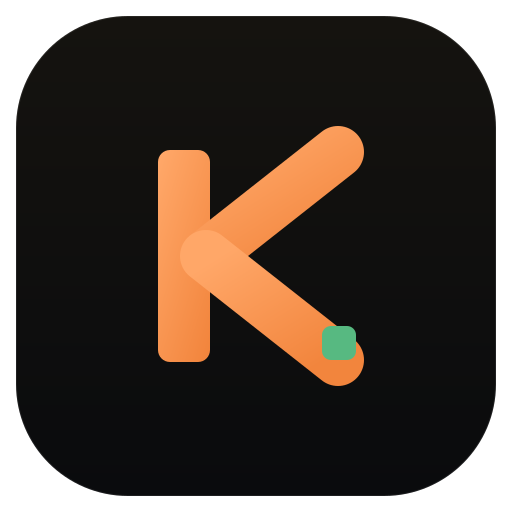

<div align="center">



# KiCaps

**A fast, minimal futures position-size calculator for Windows.**

Tune your stop loss and risk, and KiCaps tells you exactly how many contracts to trade — with a verdict-first **Risk Check** that turns green / orange / red so you know at a glance whether the position is inside your limit.

<br/>

[](https://github.com/Ledian63S/KiCaps/releases/latest)


<br/>


</div>

---

## Download & Install

1. Open the [**latest release**](https://github.com/Ledian63S/KiCaps/releases/latest).
2. Under **Assets**, download **`KiCaps-Setup-<version>.exe`**.
3. Run the installer — it adds a desktop and Start Menu shortcut, then launches KiCaps.

> **Note:** The app isn't code-signed, so Windows SmartScreen may show a warning on first run. Click **More info → Run anyway**.

Prefer to run from source? See [Running from Source](#running-from-source).

---

## Features

- **Verdict-first Risk Check** — the center panel recolors **green (under) / orange (on target) / red (over limit)**, so you instantly know whether the position fits your risk budget. Shows actual risk, target, the delta (Δ), and a utilization bar.
- **Instant position sizing** — contracts recalculated in real time as you tune stop loss and risk.
- **Stop Loss Ladder** — scrollable table centered on your stop, showing SL $, actual risk, and how each nearby level lands versus your target (green under budget, red over).
- **Step or type** — nudge stop loss, risk, and contracts with ± buttons, or click any number to type it directly.
- **Manual override** — bump contracts up or down from the auto value, with a one-click reset to **AUTO**.
- **Instrument chips + watchlist** — star your favourite instruments for quick one-tap switching.
- **Risk modes** — fixed dollar amount or % of account balance.
- **Dark / Light / System theme.**
- **Persistent settings** — balance, risk, and instrument remembered across sessions (configurable).
- **Frameless window** with working minimize, maximize, close, and drag.

---

## Instruments

| Ticker | Name | Point Value |
|--------|------|-------------|
| ES | E-mini S&P 500 | $50/pt |
| NQ | E-mini Nasdaq | $20/pt |
| GC | Gold Futures | $10/pt |
| 6E | Euro FX | $12.50/pt |
| 6B | British Pound | $6.25/pt |
| MES | Micro S&P | $5/pt |
| MNQ | Micro Nasdaq | $2/pt |
| MGC | Micro Gold | $1/pt |

---

## Running from Source

**Requirements:** Node.js 18+

```bash
git clone https://github.com/Ledian63S/KiCaps.git
cd KiCaps
npm install
npm start
```

---

## Building the Windows Installer

```bash
npm install
npm run build
```

electron-builder produces the installer at **`dist/KiCaps-Setup-<version>.exe`** (NSIS target, x64).

---

## Tech Stack

- [Electron](https://www.electronjs.org/) — cross-platform desktop shell
- [React 18](https://react.dev/) — UI framework (bundled locally, works offline)
- [Babel Standalone](https://babeljs.io/) — in-browser JSX transform
- [IBM Plex Sans](https://www.ibm.com/plex/) + [JetBrains Mono](https://www.jetbrains.com/lp/mono/) — interface and numeric fonts

---

## License

MIT
