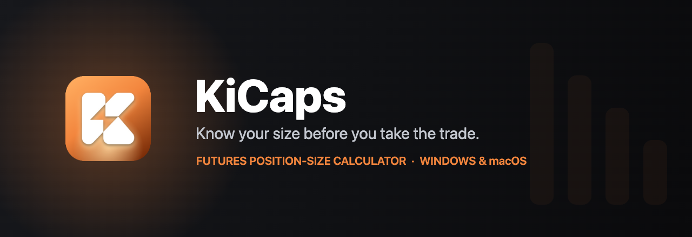
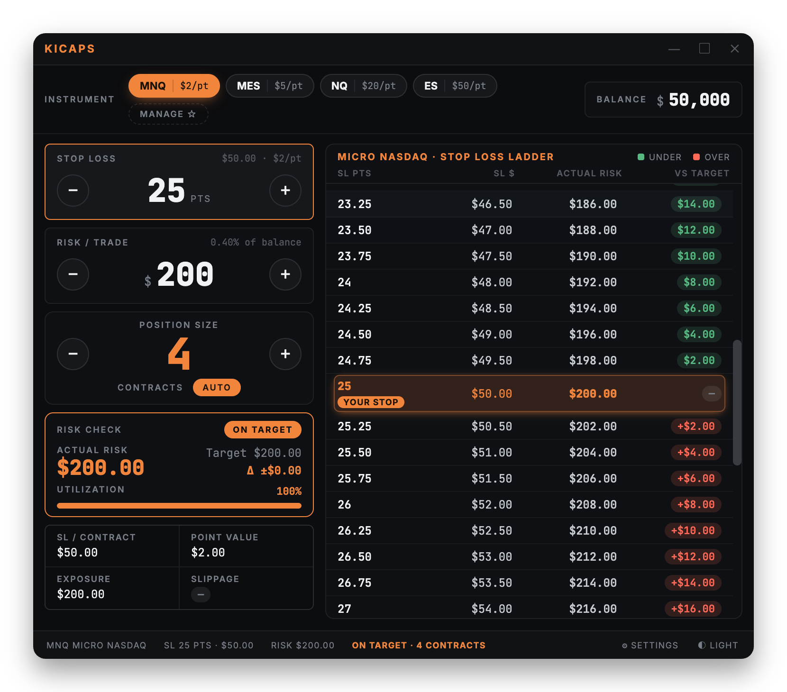
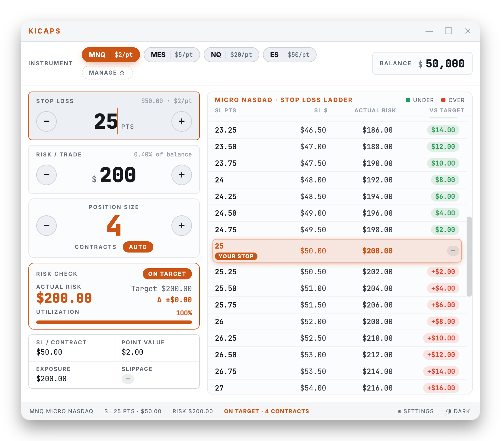

<div align="center">



<br/>
<br/>

[](https://github.com/Ledian63S/KiCaps/releases/latest)


</div>

<br/>

> **A fast, offline futures position-size calculator.** Set your stop and your risk — KiCaps tells you exactly how many contracts to trade, and turns **🟢 green / 🟠 orange / 🔴 red** the moment you step outside your limit.

<br/>

<div align="center">
  
</div>

---

## 🎯 How it works

Position sizing is one equation, and KiCaps keeps it honest:

```
contracts = risk budget ÷ (stop loss in points × point value)
```

You give it three things — **instrument**, **stop loss**, and **risk per trade** — and it answers the questions that actually matter:

| It answers… | …right here |
|---|---|
| *How many contracts?* | The big **Position Size** number |
| *Am I actually inside my risk limit?* | The **Risk Check** verdict — 🟢 under · 🟠 on target · 🔴 over |
| *What if my stop were wider or tighter?* | The **Stop Loss Ladder** — every nearby stop, priced out |

Because contracts are whole numbers, your real risk almost never lands *exactly* on target. KiCaps shows that gap (**Δ**) and the **utilization** bar — so "close enough" is a decision you make, not one you discover later.

---

## ✨ Features

<table>
<tr>
<td width="50%" valign="top">

**🚦 Verdict-first Risk Check**
Actual risk, target, delta, and a utilization bar. The panel recolours, so a glance is enough.

</td>
<td width="50%" valign="top">

**🪜 Stop Loss Ladder**
Every nearby stop priced out — SL $, actual risk, and vs-target as colour-coded chips. Click a row to jump your stop there.

</td>
</tr>
<tr>
<td width="50%" valign="top">

**⌨️ Fast input**
± buttons, **↑ / ↓** arrows (Shift = ×5), or the **mouse wheel** over a field. Or click and type — digits only.

</td>
<td width="50%" valign="top">

**🎚️ Manual override**
Nudge contracts off the auto value when you want to, one click back to **AUTO**.

</td>
</tr>
<tr>
<td width="50%" valign="top">

**⭐ Instrument watchlist**
Star your favourites for one-tap switching; hover a chip for the full name.

</td>
<td width="50%" valign="top">

**📐 Risk modes**
A fixed dollar amount, or a percentage of account balance.

</td>
</tr>
<tr>
<td width="50%" valign="top">

**↔️ Resizable layout**
Drag the divider between the sizing panel and the ladder — the width is remembered.

</td>
<td width="50%" valign="top">

**🔒 Fully offline**
No network calls, no telemetry, fonts bundled locally. It just works on a plane.

</td>
</tr>
</table>

---

## 🌗 Dark & Light

<div align="center">
  
  
</div>

<div align="center"><sub>System-aware — follows your OS, or lock it to Dark / Light in Settings.</sub></div>

---

## ⌨️ Keyboard & mouse

| Action | Shortcut |
|---|---|
| Adjust Stop Loss / Risk | `↑` `↓`  ·  Shift = ×5 |
| Adjust Stop Loss / Risk | Mouse wheel over the field |
| Jump your stop to a ladder row | Click the row |
| Reset contracts to auto | Click **AUTO** |
| Zoom the whole UI | `⌘ +` / `⌘ -` |

---

## 📊 Instruments

| | | | |
|---|---|---|---|
| **ES** · E-mini S&P 500 — $50/pt | **NQ** · E-mini Nasdaq — $20/pt | **GC** · Gold — $10/pt | **6E** · Euro FX — $12.50/pt |
| **6B** · British Pound — $6.25/pt | **MES** · Micro S&P — $5/pt | **MNQ** · Micro Nasdaq — $2/pt | **MGC** · Micro Gold — $1/pt |

---

## ⬇️ Install

Grab the latest build from **[Releases](https://github.com/Ledian63S/KiCaps/releases/latest)**.

- **🪟 Windows** — run `KiCaps-Setup-<version>.exe` (adds desktop + Start Menu shortcuts).
- **🍎 macOS** — open the `.dmg` and drag **KiCaps** to Applications. Use the **arm64** build on Apple Silicon, **x64** on Intel.

> [!NOTE]
> The app isn't code-signed yet. **Windows** SmartScreen may warn → **More info → Run anyway**. **macOS** may say *"damaged"* (that's Gatekeeper, not corruption) → open Terminal and run `xattr -cr /Applications/KiCaps.app`, then launch it.

---

## 🛠️ Run from source

**Requires:** Node.js 18+

```bash
git clone https://github.com/Ledian63S/KiCaps.git
cd KiCaps
npm install
npm start          # compiles the UI, then launches Electron
```

The UI lives in **`src/app.jsx`** and is compiled to `app.js` by `npm run build:js` (run automatically by `npm start`).

```bash
npm run build       # Windows installer  → dist/KiCaps-Setup-<version>.exe
npm run build:mac   # macOS disk image    → dist/KiCaps-<version>-<arch>.dmg
```

---

## 🧱 Tech

- **[Electron](https://www.electronjs.org/)** — desktop shell, hardened: `contextIsolation` on, `nodeIntegration` off, strict Content-Security-Policy, no remote content.
- **[React 18](https://react.dev/)** — bundled locally and **precompiled with [esbuild](https://esbuild.github.io/)**; no runtime JSX transform is shipped.
- **[Inter](https://rsms.me/inter/) + [JetBrains Mono](https://www.jetbrains.com/lp/mono/)** — self-hosted; numbers use tabular figures so columns line up.

---

<div align="center">
<sub>Built by <b>Ledian Leka</b> · <a href="LICENSE">MIT License</a></sub>
</div>
